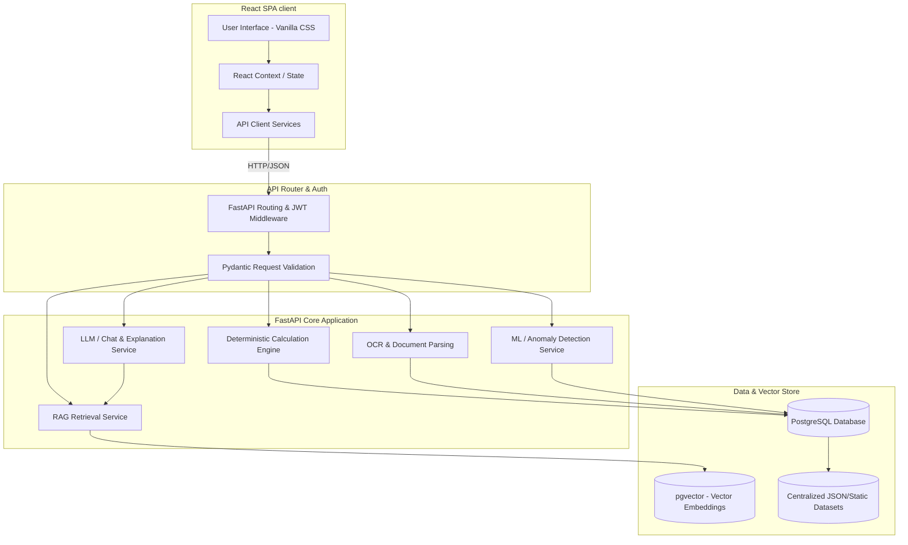

# System Architecture Document

This document outlines the architecture, component boundaries, and operational layers of CareFin.

---

## 1. Overview Diagram

---

## 2. Layer Definitions

### 2.1 Frontend Client (React + Vite + TypeScript)
* **Single Page Application (SPA)**: Renders the CareFin dashboard, insurance manager, claims interface, hospital search panels, and funding pages.
* **Styling**: Structured Vanilla CSS variables (`design-tokens.css` injected globally) to guarantee uniform coloring, spacing, and accessibility metrics.
* **State Management**: Built-in React Context hooks for active insurance policy details, active user profiles, and application themes.

### 2.2 API Layer & Router (FastAPI)
* **Pydantic Validation**: Strong runtime schema validation on all inputs and outputs.
* **Authentication**: Stateless JSON Web Token (JWT) verification on protected user endpoints.

### 2.3 Backend Services (FastAPI + Python)
To prevent hallucinations and guarantee reliability, backend logic is divided into two distinct execution methodologies:

#### A. Deterministic Calculation Engine
* **Purpose**: Performs all financial computations including:
  * Hospital Out-of-Pocket calculations (deductibles, room rent caps, co-payments).
  * Crowdfunding platform disbursement estimations.
  * Funding gaps.
* **Technology**: Pure Python algorithms based on mathematical formulas. **LLMs are strictly forbidden from producing these calculations**.

#### B. AI / Machine Learning & NLP Services
* **RAG (Retrieval-Augmented Generation)**: Searches vector embeddings of policy documents, government schemes, and NGO guides using cosine similarity.
* **OCR Service**: Parses documents (bills, policies, identification letters) and extracts key-value tokens (e.g. Total Amount, Insurer Name).
* **Machine Learning**: Anomaly detection logic to scan claims for double-billing or suspicious service price hikes against centralized data.
* **NLP Explanation Service**: Takes deterministic output (e.g. a co-pay deduction) and generates a friendly, stress-free explanation of *why* the deduction occurred based on policy terms.

### 2.4 Database & Storage (PostgreSQL + pgvector)
* **Relational Storage**: Relational tables for Users, Insurance Policies, Claims, Centralized Hospital Profiles, Cities, and Procedures.
* **Vector Search**: PostgreSQL database using the `pgvector` extension.
  * Stores chunks of policy texts, scheme documents, and guidelines as vector embeddings.
  * Facilitates semantic searches matching user queries to relevant clauses.
* **Shared Static Data**: JSON data tables loaded into the database during initialization, serving as the single-source-of-truth for hospitals, cities, and procedure costs.
