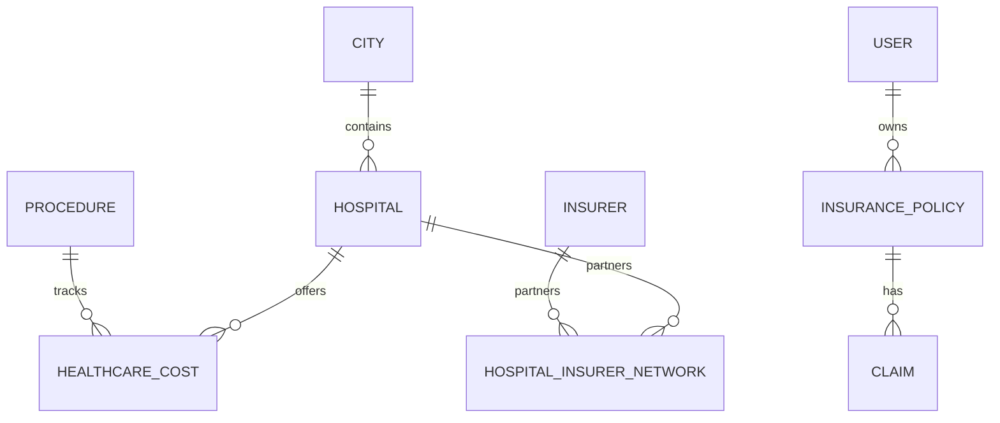

# Database Data Model Specification

CareFin uses a PostgreSQL relational database with the `pgvector` extension. This document defines the database schemas, field types, relationships, and data types.

---

## 1. Centralized Domain Tables

To enforce the **Centralized Data Rule**, the `Hospitals`, `Healthcare Costs`, and `Emergency Assistance` modules must query the same database tables.



---

## 2. Table Schemas

### 2.1 `cities`
Stores regional boundaries.
```sql
CREATE TABLE cities (
    id SERIAL PRIMARY KEY,
    name VARCHAR(100) NOT NULL UNIQUE,
    state VARCHAR(100) NOT NULL,
    created_at TIMESTAMP DEFAULT CURRENT_TIMESTAMP
);
```

### 2.2 `procedures`
Standard medical procedures.
```sql
CREATE TABLE procedures (
    id SERIAL PRIMARY KEY,
    code VARCHAR(50) NOT NULL UNIQUE, -- e.g., PROC-ANGIOPLASTY
    name VARCHAR(150) NOT NULL,
    description TEXT,
    category VARCHAR(100) NOT NULL
);
```

### 2.3 `hospitals`
Centralized hospital profiles.
```sql
CREATE TABLE hospitals (
    id SERIAL PRIMARY KEY,
    name VARCHAR(150) NOT NULL,
    city_id INTEGER REFERENCES cities(id) ON DELETE RESTRICT,
    address TEXT NOT NULL,
    contact_number VARCHAR(20),
    latitude NUMERIC(9,6),
    longitude NUMERIC(9,6),
    specialties VARCHAR(100)[] NOT NULL, -- Array of strings (e.g., Cardiology, Oncology)
    has_24x7_emergency BOOLEAN DEFAULT FALSE,
    rating NUMERIC(2,1) CHECK (rating >= 1.0 AND rating <= 5.0),
    data_type VARCHAR(10) NOT NULL DEFAULT 'demo' CHECK (data_type IN ('demo', 'verified')),
    source VARCHAR(100),
    last_verified_at TIMESTAMP,
    created_at TIMESTAMP DEFAULT CURRENT_TIMESTAMP
);
```

### 2.4 `insurers`
Insurance providers in the Indian market.
```sql
CREATE TABLE insurers (
    id SERIAL PRIMARY KEY,
    name VARCHAR(150) NOT NULL UNIQUE,
    tpa_contact_number VARCHAR(20),
    cashless_email VARCHAR(100)
);
```

### 2.5 `hospital_insurer_network`
Defines hospital-insurer cashless relationship (Network status).
```sql
CREATE TABLE hospital_insurer_network (
    id SERIAL PRIMARY KEY,
    hospital_id INTEGER REFERENCES hospitals(id) ON DELETE CASCADE,
    insurer_id INTEGER REFERENCES insurers(id) ON DELETE CASCADE,
    is_cashless_supported BOOLEAN DEFAULT FALSE,
    co_pay_requirement NUMERIC(5,2) DEFAULT 0.00, -- Specific co-pay required at this hospital
    data_type VARCHAR(10) NOT NULL DEFAULT 'demo' CHECK (data_type IN ('demo', 'verified')),
    source VARCHAR(100),
    last_verified_at TIMESTAMP,
    UNIQUE(hospital_id, insurer_id)
);
CREATE INDEX idx_network_hospital_insurer ON hospital_insurer_network (hospital_id, insurer_id);
```

### 2.6 `healthcare_costs`
Relates procedures to hospitals and stores pricing (including estimated room rent and packages).
```sql
CREATE TABLE healthcare_costs (
    id SERIAL PRIMARY KEY,
    hospital_id INTEGER REFERENCES hospitals(id) ON DELETE CASCADE,
    procedure_id INTEGER REFERENCES procedures(id) ON DELETE CASCADE,
    average_package_cost NUMERIC(12,2) NOT NULL, -- Average standard charge
    min_package_cost NUMERIC(12,2) NOT NULL,
    max_package_cost NUMERIC(12,2) NOT NULL,
    standard_room_rent_included NUMERIC(10,2) DEFAULT 0.00,
    icu_rent_included NUMERIC(10,2) DEFAULT 0.00,
    data_type VARCHAR(10) NOT NULL DEFAULT 'demo' CHECK (data_type IN ('demo', 'verified')),
    source VARCHAR(100),
    last_verified_at TIMESTAMP,
    UNIQUE(hospital_id, procedure_id)
);
```

### 2.7 `users`
```sql
CREATE TABLE users (
    id SERIAL PRIMARY KEY,
    email VARCHAR(150) NOT NULL UNIQUE,
    hashed_password VARCHAR(255) NOT NULL,
    full_name VARCHAR(100) NOT NULL,
    annual_family_income NUMERIC(12,2),
    state_of_residence VARCHAR(100),
    created_at TIMESTAMP DEFAULT CURRENT_TIMESTAMP
);
```

### 2.8 `insurance_policies`
Active policy records owned by users.
```sql
CREATE TABLE insurance_policies (
    id SERIAL PRIMARY KEY,
    user_id INTEGER REFERENCES users(id) ON DELETE CASCADE,
    insurer_id INTEGER REFERENCES insurers(id) ON DELETE RESTRICT,
    policy_number VARCHAR(100) NOT NULL UNIQUE,
    policy_name VARCHAR(150) NOT NULL,
    sum_insured NUMERIC(12,2) NOT NULL,
    deductible NUMERIC(12,2) DEFAULT 0.00,
    co_payment_percentage NUMERIC(5,2) DEFAULT 0.00,
    room_rent_limit_percentage NUMERIC(5,2), -- e.g., 1% of Sum Insured
    icu_rent_limit_percentage NUMERIC(5,2), -- e.g., 2% of Sum Insured
    waiting_period_months INTEGER DEFAULT 0,
    policy_document_url VARCHAR(255),
    meta_data JSONB DEFAULT '{}', -- OCR-extracted key-value summaries
    created_at TIMESTAMP DEFAULT CURRENT_TIMESTAMP
);
```

### 2.9 `claims`
```sql
CREATE TABLE claims (
    id SERIAL PRIMARY KEY,
    user_id INTEGER REFERENCES users(id) ON DELETE CASCADE,
    policy_id INTEGER REFERENCES insurance_policies(id) ON DELETE RESTRICT,
    hospital_id INTEGER REFERENCES hospitals(id) ON DELETE RESTRICT,
    procedure_id INTEGER REFERENCES procedures(id) ON DELETE RESTRICT,
    claim_amount NUMERIC(12,2) NOT NULL,
    settled_amount NUMERIC(12,2) DEFAULT 0.00,
    current_status VARCHAR(50) NOT NULL DEFAULT 'Submitted' CHECK (current_status IN ('Submitted', 'In Review', 'Approved', 'Rejected', 'Settled')),
    tpa_reference_number VARCHAR(100),
    timeline JSONB DEFAULT '[]'::jsonb, -- Timeline history logs
    created_at TIMESTAMP DEFAULT CURRENT_TIMESTAMP
);
```

---

## 3. RAG / Vector Store Table

To handle Retrieval-Augmented Generation for policy files and government assistance schemes, a vector table is defined:

### 3.1 `document_embeddings`
```sql
CREATE EXTENSION IF NOT EXISTS vector;

CREATE TABLE document_embeddings (
    id SERIAL PRIMARY KEY,
    document_type VARCHAR(50) NOT NULL, -- 'insurance_policy', 'govt_scheme', 'ngo_info'
    document_id INTEGER, -- References appropriate table depending on type
    page_number INTEGER,
    chunk_content TEXT NOT NULL,
    embedding vector(1536), -- 1536 dimension for OpenAI text-embedding-3-small / similar
    meta_data JSONB DEFAULT '{}',
    created_at TIMESTAMP DEFAULT CURRENT_TIMESTAMP
);

CREATE INDEX idx_doc_embeddings_cosine ON document_embeddings USING hnsw (embedding vector_cosine_ops);
```
